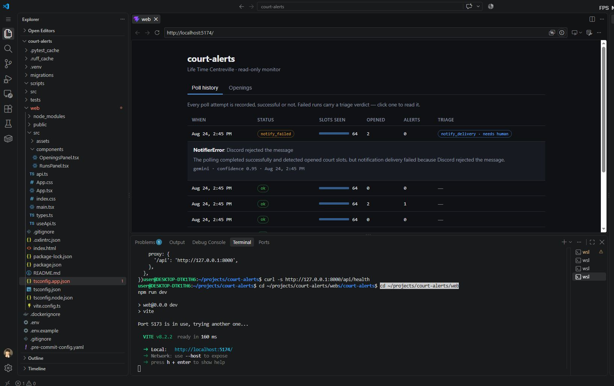

# court-alerts

[English](README.md)

Life Time 클럽의 피클볼 코트 예약 현황을 읽기 전용으로 감시하다가,
예약이 취소되어 자리가 나면 Discord로 알림을 보내는 도구입니다.
폴링이 실패하면 LLM 분류 에이전트가 원인을 판정하는데, 그 출력은
검증되고, 범위가 제한되며, 결코 그대로 신뢰되지 않습니다.

---

## 문제

Life Time에는 대기자 알림 기능이 있습니다. 문제는 대기자 명단에
등록할 수 있는 인원에 상한이 있다는 점입니다. 그 정원이 차면 나머지
회원은 명단에 들어갈 수 없고, 명단에 없는 회원은 자리가 나도 아무런
알림을 받지 못합니다.

즉 "기능이 없다"가 아니라 **기능에 대한 접근이 배급된다**는 것이
문제입니다. 그리고 배제되는 사람이 정확히 그 기능을 필요로 하는
사람입니다. 취소는 수시로 발생하지만, 알림이 없으면 예약 페이지를
직접 새로고침하는 것 말고는 발견할 방법이 없습니다.

## 허가에 대하여

실제 Life Time 엔드포인트를 대상으로 코드를 작성하기 전에, 클럽과
본사 컨시어지에 이메일로 문의했습니다. 이 도구가 무엇을 하는지
구체적으로 밝혔습니다 — 읽기 전용, 개인 사용, 자동 예약 없음, 낮은
고정 간격의 폴링.

회신은 위에 설명한 대기자 정원 제한을 확인해 주었고, 도구 자체에
대해서는 이의를 제기하지 않았으며, 이 의견이 클럽 피클볼 팀과 개발
팀에 전달되었다고 알려왔습니다. 다만 이용약관에 관한 명시적인 서면
답변은 주지 않았습니다.

**그 답변을 받지 못했기 때문에, 이 저장소에는 실제 Life Time 어댑터가
포함되어 있지 않습니다.** 유일한 구현은 결정론적 mock입니다. 일정
소스는 `ScheduleProvider` 인터페이스 뒤에 있으므로, 나중에 실제
어댑터를 추가하는 일은 파일 하나를 더하는 것으로 끝나며 핵심 로직은
바뀌지 않습니다.

이것은 설계 결정인 동시에 컴플라이언스 결정이었습니다.

---

## 60초 만에 실행하기

API 키가 필요 없습니다. 시크릿이 없으면 콘솔 출력과 규칙 기반
분류로 자동 폴백합니다.

```bash
docker compose up -d          # 5433 포트에 Postgres
uv sync
uv run court-alerts demo      # mock으로 폴링 두 사이클
```

예상 출력:

```
Club: Life Time Centreville  Date: 2026-08-24  Notifier: console
cycle 1: status=ok slots=64 opened=0 alerts=0
cycle 2: status=ok slots=64 opened=2 alerts=1
```

1번 사이클은 모든 코트가 예약된 날의 콜드 스타트라 새로 열린 것이
없습니다. 2번 사이클에서 취소 두 건이 발생하고, 이것이 감지되어
**하나의 메시지로 묶여** 전달됩니다.

실제 연동을 사용하려면 `.env.example` 을 `.env` 로 복사한 뒤
`DISCORD_WEBHOOK_URL`, `GEMINI_API_KEY`, `GEMINI_MODEL` 을 채우면
됩니다.

기타 명령:

```bash
uv run alembic upgrade head            # demo가 자동으로 실행합니다
uv run court-alerts triage             # 아직 분류되지 않은 실패를 판정
uv run court-alerts eval               # 골든셋으로 LLM 채점
uv run court-alerts eval --agent heuristic
uv run pytest -q                       # 53개 테스트
```

---

## 아키텍처

의존성은 안쪽으로만 향합니다. `core/` 의 어떤 모듈도 provider, DB,
HTTP 클라이언트를 import하지 않습니다.

```
core/models.py        Slot, CLUB_TZ            (아무것도 import 안 함)
       ^
core/diff.py          취소 감지
core/subscription.py  누가 어떤 슬롯에 관심 있는지
       ^
providers/base.py     ScheduleProvider 계약
notify/base.py        Notifier 계약
triage/base.py        TriageAgent 계약
       ^
providers/mock.py  notify/discord.py  triage/gemini.py  db/
       ^
poller.py             이것들이 만나는 유일한 지점
       ^
api/                  읽기 전용 HTTP 계층
```

그 결과:

- 유닛 테스트 44개가 DB도 네트워크도 없이 0.5초 안에 끝납니다.
- mock provider를 실제 것으로 교체하는 데 파일 하나만 건드립니다.
- 실패할 수 있는 모든 경계마다 인-프로세스 구현이 짝으로 있습니다
  (`MockProvider`, `ConsoleNotifier`, `HeuristicTriageAgent`).
  덕분에 시크릿 없이 전체 파이프라인이 오프라인으로 돌아갑니다.

### 데이터 모델

스냅샷은 append-only입니다. 폴링마다 `snapshots` 한 행과 그에 속한
`snapshot_slots` 를 쓰고, 성공이든 실패든 모든 시도가 `poll_runs` 에
한 행을 남깁니다. 제자리 수정이 없으므로 폴링이 중간에 죽어도 이전
상태가 훼손되지 않으며, 이 실행 이력이 분류 에이전트가 읽는 원재료가
됩니다.

모든 타임스탬프는 `timestamptz` 이고, 읽을 때 클럽 로컬 시간으로
되돌립니다. naive datetime으로 저장했다면 서머타임이 해제되는 날
같은 벽시계 시각이 한 해에 두 번 중복되었을 것입니다.

스키마 변경은 Alembic을 거칩니다. 모델과 마이그레이션이 일치하는지
검사하는 테스트가 있어서, 스키마 드리프트는 배포가 아니라 테스트
단계에서 걸립니다.

---

## 트레이드오프: at-least-once 전달

`run_poll` 은 알림을 시도하기 **전에** 스냅샷을 커밋합니다.

그 뒤 전달이 실패하면 최악의 경우 다음 사이클에 같은 알림이 한 번 더
갑니다. 순서가 반대여서 스냅샷을 잃으면, 다음 사이클이 콜드 스타트가
되어 **스케줄상 비어 있는 모든 코트가 한꺼번에 알림으로 나갑니다.**

중복 하나는 회복 가능합니다. 알림 폭탄은 사용자가 채널을 음소거하게
만들고, 그러면 이 도구의 존재 이유가 조용히 사라집니다.

이 순서는 테스트로 고정되어 있습니다 — 전달을 강제로 실패시킨 뒤,
다음 사이클이 새로 열린 슬롯 0개를 보고해야 합니다.

---

## LLM 실패 분류

폴링이 실패했을 때 중요한 질문은 *실패했다는 사실*이 아니라 *어떤
종류의 실패인가* 입니다 — 재시도하면 되는 타임아웃인지, 만료된
자격증명인지, 코드 수정이 필요한 상위 스키마 변경인지. 이 셋은
구조화된 필드에서는 완전히 똑같아 보이고, 자유 형식 에러 메시지에서만
구분됩니다. 언어 모델이 값을 하는 지점이 정확히 여기입니다.

안전장치 네 가지이며, 각각 특정 실패 양상에 대응합니다:

**1. 원본 예외가 아니라 범위가 제한된 evidence.**
`build_evidence()` 는 명시적으로 나열된 필드만으로 평평한 JSON 번들을
만듭니다. 예외 객체, 응답 본문, 설정값은 통째로 복사되지 않습니다.
웹훅 URL이나 API 키가 프롬프트로 들어갈 경로 자체가 없습니다 —
필터가 걸러내기 때문이 아니라, **애초에 담기지 않는 그릇이기**
때문입니다.

**2. 명시적인 탈출구.**
`TriageCategory` 에는 `NO_ISSUE` 와 `UNKNOWN` 이 있고, 프롬프트는
추측이 불확실성을 인정하는 것보다 나쁘다고 명시합니다. "아무 문제
없다"고 말할 방법이 없는 분류기는 정상 실행에 대해 문제를 지어내고,
"모르겠다"고 말할 방법이 없는 분류기는 한 줄짜리 에러에서 진단을
날조합니다.

**3. 검증하고, 폴백하고, 절대 raise하지 않음.**
`parse_verdict()` 는 아무것도 신뢰하지 않습니다. JSON이 아닌 출력,
지어낸 카테고리 문자열, `"high"` 나 `7.5` 같은 confidence, 누락된
필드, 마크다운 코드펜스로 감싼 응답 — 전부 예외가 아니라 유효한
판정으로 귀결됩니다. 인식되지 않는 카테고리는 `UNKNOWN` 이 되고,
confidence는 `[0, 1]` 로 클램프되며, `needs_human` 의 기본값은
`True` 입니다. `safe_triage()` 가 마지막 방어선으로 전체를 감쌉니다.

**4. 재시도로 고칠 수 있는 것만 재시도.**
HTTP 429와 5xx는 지수 백오프로 재시도합니다. 401과 404는 하지
않습니다 — 같은 요청은 같은 답을 돌려줄 뿐입니다.

분류는 폴링 루프 안이 아니라 별도 명령으로 돌고, 실제로 실패한
실행만 대상으로 합니다. 정상 실행까지 모델에 보내면 비용만 들고
`no_issue` 외에는 나오는 것이 없습니다.

### 우연히 검증된 부분

개발 중 하루 오후에 API가 세 가지 다른 방식으로 실패했습니다. 모델
이름을 잘못 설정해 모든 요청이 404를 받았고, 부하로 503이 났고, 읽기
타임아웃이 발생했습니다. 그 모든 상황에서 폴러는 계속 동작했고, 모든
판정이 `needs_human=True` 인 `UNKNOWN` 으로 돌아왔으며, **잘못된
진단은 단 하나도 생성되지 않았습니다.** 404 사례는 4번 안전장치를
반대 방향에서 확인해 주기도 했습니다 — 존재하지 않는 이름을
재시도했다면 작업 실행 시간만 낭비했을 것입니다.

복구 과정도 마찬가지로 유익했습니다. 모델 이름을 되돌리자 즉시 정상
동작했고, 이는 404가 요청 형식과 무관했음을 확인해 주었습니다.

관측 계층이, 관측 대상을 망가뜨리지 않으면서 degrade한 것입니다.

---

## 웹 UI

읽기 전용 FastAPI 계층(`/api/runs`, `/api/openings`,
`/api/subscriptions`)과 단일 페이지 React 대시보드입니다. 쓰기
엔드포인트는 없습니다 — API 어디에도 `commit()` 이 없고, CORS는 단일
출처와 `GET` 으로만 제한했습니다.



UI의 핵심은 폴링 이력입니다. 알림 자체는 이미 Discord로 가기 때문에
빈자리를 볼 곳이 하나 더 생기는 건 큰 의미가 없습니다. 하지만
**모니터 자신이 건강한지는 Discord에 나타나지 않습니다.** 이 표가 그걸
보여줍니다 — 모든 시도, 슬롯 수를 막대로 그려 0으로 떨어지는 것을
숫자를 읽지 않고도 알 수 있게 한 것, 감지된 빈자리 수, 실제로 나간
알림 수, 그리고 실패한 실행에 붙은 분류 판정. 실패 행을 클릭하면
원본 에러와 모델의 해석이 펼쳐집니다.

스크린샷은 실제 실패입니다. 폴링은 성공해서 빈자리 2개를 찾았고,
전달이 실패했으며, 분류기가 그 두 사실을 정확히 분리했습니다.

```bash
uv run uvicorn court_alerts.api.app:app --port 8000   # API, 8000 포트
cd web && npm install && npm run dev                  # UI, 5173 포트
```

---

## 배포

Google Cloud에 예약 실행되는 Cloud Run Job으로 동작합니다.

- **Cloud Run Job** — 실행마다 새 프로세스이기 때문에 모든 상태가
  메모리가 아니라 Postgres에 있습니다.
- **Cloud SQL (Postgres 16)** — Unix 소켓으로 접속하므로, 연결
  문자열을 어딘가에 저장하지 않고 실행 시점에 시크릿으로부터
  조립합니다.
- **Secret Manager** — DB 비밀번호, Discord 웹훅, Gemini 키가 실행
  시점에 주입됩니다. Job의 서비스 계정은 `cloudsql.client`,
  `logging.logWriter`, 그리고 그 세 시크릿에만 개별적으로 부여된
  `secretAccessor` 만 가집니다.
- **Cloud Scheduler** — 15분마다 Job을 트리거합니다.

여기까지 오는 동안 겪은 세 가지 실패를 기록해 둡니다. 각각이 오타가
아니라 실수의 *범주*이기 때문입니다.

**로그가 없었던 것.** 첫 배포는 로그가 전혀 남지 않은 채
실패했습니다. `logging.googleapis.com` 을 활성화하지 않았기
때문이었습니다. 무엇이 잘못됐는지 말할 방법이 없는 컨테이너를 놓고
30분을 추측으로 보냈습니다. 나중에 붙이는 관측 수단은, 정작 필요할 때
없는 관측 수단입니다.

**캐리지 리턴 하나.** `.env` 가 CRLF 줄바꿈을 쓰고 있어서 웹훅
시크릿 끝에 `\r` 이 붙어 저장됐습니다. `httpx` 는 요청을 보내기도
전에 URL을 거부하며 `InvalidURL` 을 던졌는데, 이것은
`httpx.RequestError` 의 하위 클래스가 아니라서 `DiscordNotifier` 가
잡지 못했고, 설정 오류가 전달 실패로 기록되는 대신 폴러를
죽였습니다. 예외 처리 범위를 넓히고 시크릿을 읽을 때 `\r` 을 제거해
고쳤으며, 회귀 테스트로 고정했습니다.

**소켓 누락처럼 보였던 정지된 데이터베이스.** 폴러가 Cloud SQL 소켓
경로에서 `OperationalError: No such file or directory` 로
실패했습니다. 설정 문제처럼 읽히는 메시지였고, 어노테이션과 IAM
바인딩을 확인하는 데 20분이 들었습니다. 실제 원인은 세 줄 아래,
Cloud SQL 프록시가 남긴 `Error 409 ... invalidState` 였습니다.
비용을 아끼려고 인스턴스를 정지시켜 두었기 때문에 프록시가 애플리케이션이
찾던 소켓을 만들지 않았던 것입니다. 증상과 원인이 서로 다른 로그
스트림에 있었고, "소켓 설정 오류"와 "데이터베이스 정지"를 구분해 주는
구조화된 필드는 존재하지 않습니다. 오직 자유 텍스트만이 구분합니다.
분류 에이전트가 존재하는 이유가 정확히 이 구분이고, evidence 번들이
에러 타입뿐 아니라 에러 메시지를 싣는 이유이기도 합니다.

---

## 평가

`evals/cases.py` 에는 정답이 붙은 evidence 번들 12개가 있고, 세 가지
종류의 판단을 다룹니다:

- **구분** — `expired_session`, `forbidden`, `shape_changed` 는 모두
  `status=provider_failed` 입니다. 에러 텍스트만이 이들을 구분하고,
  각각 필요한 대응이 다릅니다.
- **거짓 양성 저항** — `recovered_delivery` 와 `quiet_but_healthy` 는
  불안해 보이는 이력을 담고 있지만 실제로는 정상입니다.
- **정직한 불확실성** — `no_history` 와 `uninformative_error` 는
  `unknown` 이 정답입니다.

| 에이전트 | 카테고리 | needs_human |
|---|---|---|
| `HeuristicTriageAgent` (규칙) | 8 / 12 | 8 / 12 |
| `GeminiTriageAgent` | **10 / 12** | **12 / 12** |

규칙 기반 베이스라인의 실패는 튜닝의 문제가 아니라 구조적입니다.
에러 텍스트를 읽지 않기 때문에 `expired_session`, `forbidden`,
`shape_changed` 를 전부 `transient_upstream` 으로 뭉개고,
`uninformative_error` 에 대해서는 "모르겠다"라는 개념 자체가 없어서
`transient_upstream` 이라고 단정합니다. 모델은 이 넷을 모두
맞혔습니다.

흥미로운 부분은 모델이 진 지점입니다. 두 개의 오답 —
`persistent_timeouts` 와 `empty_schedule` — 은 틀린 카테고리가 아니라
`unknown` 을 반환했습니다. `empty_schedule` 은 순수하게 수치 판단이고
(slot_count가 계속 64였다가 0으로 떨어짐) 규칙 기반은 이것을 손쉽게
잡습니다. `persistent_timeouts` 는 제가 붙인 정답 자체가 미심쩍은
쪽입니다 — 동일한 실패가 다섯 번 연속이면 그것을 "일시적"이라고
부르는 것이 타당한지 의문이고, 모델이 그 이유로 판단을 보류했을 수
있습니다.

즉 두 접근은 서로 반대 방향으로 실패합니다. 규칙은 수치 임계값에는
믿음직하고 산문에는 눈이 멀었으며, 모델은 산문을 잘 읽고 산술 앞에서
머뭇거립니다. 실제 운영 버전이라면 규칙을 먼저 돌리고 남은 것만
모델에 넘길 것입니다 — 이 결론을 추측이 아니라 근거로 만들어 주는
것이 바로 평가셋입니다.

두 오답 모두 자신 있는 오진이 아니라 `unknown` 으로 떨어졌고,
`needs_human` 은 12개 전부 맞았습니다. 이 설계가 막으려 했던 실패
양상 — 그럴듯하게 들리는 틀린 진단 — 은 발생하지 않았습니다.

---

## 테스트

테스트 53개. 유닛 테스트는 I/O 없이 순수 로직을 다루고, 통합
테스트는 **별도의 데이터베이스**에서 Postgres를 대상으로 돌며 각
테스트가 트랜잭션 안에서 실행된 뒤 롤백됩니다.

이 분리는 실제 실패를 겪고 나서 추가했습니다. 처음에는 통합 테스트가
애플리케이션 DB를 공유했기 때문에, 데모를 한 번 돌리면 콜드 스타트
테스트가 깨졌습니다. 테스트 결과가 그 전에 무엇을 실행했는지에
좌우된 것인데, 그것은 거짓말을 하는 테스트 스위트입니다.

특히 언급할 만한 테스트 넷:

- `test_snapshot_survives_a_delivery_failure` 는 위의 at-least-once
  트레이드오프를 고정합니다.
- `test_scoring_a_crashing_agent_does_not_raise` 는 분류 에이전트가
  폴러를 죽일 수 없음을 골든 케이스 12개 전부에 대해 증명합니다.
- `test_factory_falls_back_to_console_without_a_webhook` 이 존재하는
  이유는, 한때 `notify/factory.py` 가 비어 있는데도 테스트 32개가 전부
  통과했기 때문입니다. 조립 코드에 아무 테스트도 닿지 않았던 것입니다.
- `test_models_and_migrations_agree` 는 모델이 바뀌었는데 대응하는
  마이그레이션이 없으면 실패합니다. 스키마 드리프트가 배포까지
  살아남지 못하게 하는 장치입니다.

---

## 시크릿

`.env` 는 gitignore되어 있고, `.env.example` 은 값 없이 필요한 키
이름만 문서화합니다. Gemini 키는 `?key=` 쿼리 파라미터가 아니라
`x-goog-api-key` 헤더로 전송되므로, 프록시 로그나 예외 메시지의 URL을
통해 유출될 수 없습니다. 에러 핸들러가 응답 본문 일부를 진단 정보로
남길 수 있는 것도 이 때문입니다.

Discord의 예외는 전체 웹훅 URL을 문자열에 포함하기 때문에,
`DiscordNotifier` 는 예외 클래스 이름만 전달합니다.

운영 환경에서는 세 시크릿이 Secret Manager에 있고 실행 시점에
환경변수로 주입되며, Job의 서비스 계정은 그 셋만 읽을 수 있습니다.

---

## 아직 만들지 않은 것

- **실제 Life Time 어댑터** — 이용약관에 대한 서면 답변을 조건으로
  합니다. 인터페이스는 준비되어 있고, 파일 하나면 됩니다.
- **구독 쓰기** — 구독 조건이 아직 `cli.py` 에 하드코딩되어 있고 읽기
  전용으로만 제공됩니다. DB로 옮기고 생성 폼을 붙이는 것이 다음
  단계입니다.
- **Infrastructure as code** — 배포가 gcloud 명령의 나열입니다. 부분
  업데이트 한 번이 Cloud SQL 연결 설정을 조용히 지운 적이 있는데,
  선언적 구성(Terraform 또는 `gcloud run jobs replace job.yaml`)이
  정확히 그 실패를 막아줍니다.
- **프론트엔드 테스트** — 파이썬 쪽은 53개, React 쪽은 0개입니다.